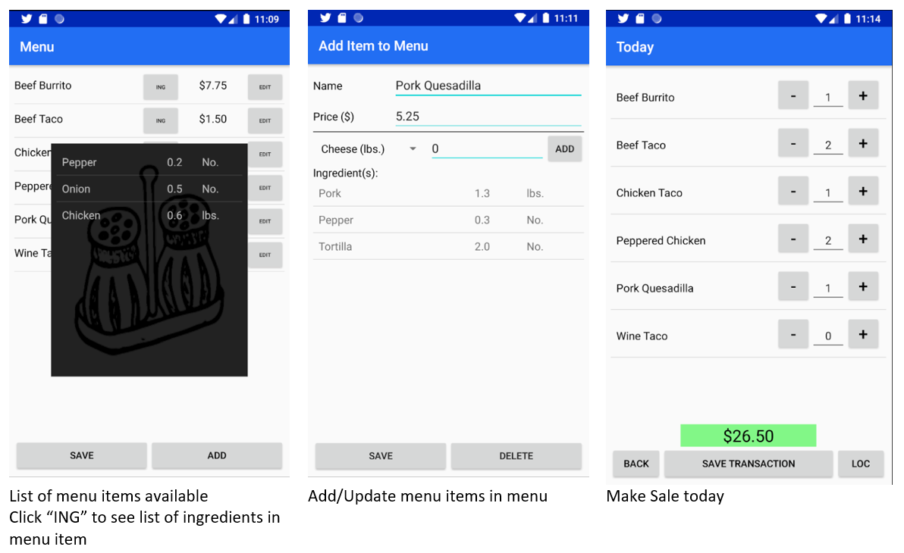

# Hawker  (Java Android App) 

## Motivation
In LA, there are thousands of food vendors that own a cash only small business. This includes taco stands, fruit carts, ice cream trucks, etc. Many cash businesses like this have one or two people running the entire operation which sometimes leads to them having to optimize speed. Many times, they find it more efficient to not keeping track of transactions during service or conveniently scribbling on paper. Because of this, estimates are usually in bookkeeping for profit analysis and even tax. 

This app looks to assist them with both inventory management and bookkeeping. It will provide a quick and easy way to keep track of sales every night, with added benefits of serving as a quick calculator. The app combines the activities of bookkeeping, transaction calculation and inventory updating all at once which is the purpose of a complete Point of Sale (PoS) system. This gives these small businesses the ability to have those same benefits for free on a simple app. 

## App Description
Hawker (meaning a person who travels around selling goods) is an app designed to assist mobile food sellers that are primarily cash based. This app will help the owners/chefs manage and track inventory, track sales and serve as a customizable calculator during sale. 

## Sample User Profile: 
Taco man in L.A that sets up stand in different locations over the week

### Hawker Features:
* Provides controlled menu list  - Tacos, Burritos, etc.
* Provides controlled list of ingredients in inventory – Cheese, chicken, etc.
* Provides quick calculator for every sale made.
* Dynamically reduces ingredients in the inventory as sales are made.
* Records every transaction/sale made.  
* Send out current location to social media account (e.g Twitter) when on the move.

## Target Audience
*	Food trucks
*	Taco/Hotdog/Fruit carts

## Data Storage - Firestore
### Documents: 
* Ingredients
* Menu Items
* Sales

## Feature Screenshots:

